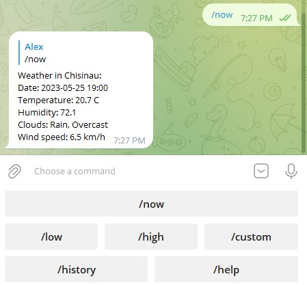

# Telegram Weather Bot
Telegram Weather Bot is an application for telegram that provides weather forcast for up 7 days based on specified city.
Makes use of aiogram 3.0.0b7 for connecting to telegram and SQLite for DB.

## Installation

Use the package manager [pip](https://pip.pypa.io/en/stable/) to install requirements.txt.

```bash
pip install -r requirements.txt
```
Before use, you need:
1. Get your own BOT_API - Telegram bot token from 'bot father' (its easy, just google it).
2. Create your own account at rapidAPI and get your own SITE_API key ("X-RapidAPI-Key"), I used this API: [Visual Crossing Weather](https://rapidapi.com/visual-crossing-corporation-visual-crossing-corporation-default/api/visual-crossing-weather).
3. Fill tokens you got from step 1 and 2 in ".env.template" and rename it to ".env"

You are all set to go!
## This is how it looks

## Usage

```python
# Runs from main.py

#/start - activates this bot and provides keybord with all functions from below.
#/now - "/now" or "/now CITY_NAME" - returns weather in current hour, based on the last city asked, default Chisianu.
#/low - "/low" or "/low CITY_NAME" -  returns hour when temperature is lowest for today.
#/high - "/high" or "/high CITY_NAME" - returns hour when temperature is highest for today.
#/custom - "/custom CITY_NAME YYYY-MM-DD HH" - returns forecasted weather for the specified city and time. 
# Forecasts are made only for 7 days in advance.

#It also reacts to 'Привет' and '/hello-world'
```
## Contributing

Pull requests are welcome. This was my first telegram bot project, it was fun.


## License

[MIT](LICENSE.txt)